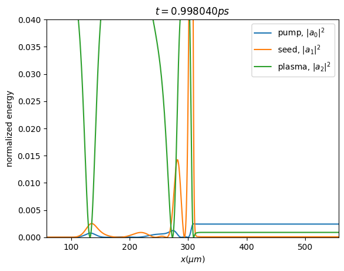

# Three-Wave Interaction



## Dependencies
```
pip install numpy matplotlib taichi tqdm
```

## Run simulation
```
python interaction.py
```

## Analyze data
Use `analysis.ipynb` jupyter notebook

## Make anime
After data is generated, run
```
python make_anime.py
```